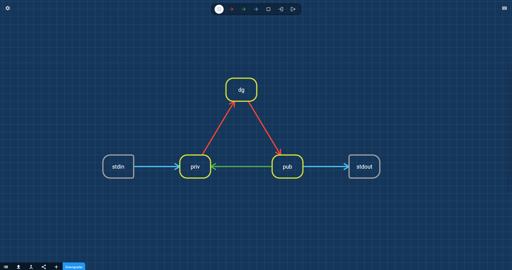

# DIFTAM editor

Flutter app for editing DIFTAM security policies, which are essentially directed graphs. 

Developed as part of my undergraduate thesis.

Tested only on MacOS and the web.

## Submodules

The app uses the [diftam_lib](https://github.com/zspiler/diftam_lib) library, which is imported as a git submodule.

To automatically initialize and update the submodule when cloning, use the `--recurse-submodules` option.

Alternatively, you can initialize the submodule manually after cloning:

`git submodule init`

`git submodule update`

To update the submodule to lastest commit in `diftam_lib` repo, you can use:

`git submodule update --remote --merge`

## Running the app

#### Web
`flutter run -d chrome`

#### MacOS

`flutter run -d MacOS`

To run the MacOS app need to have XCode and some other tools installed: 

https://docs.flutter.dev/get-started/install/macos/desktop

In my case, I also had to have at least one Simulator installed before 
the MacOS app could be run (?).

*TLDR*

`sudo xcode-select --switch /Applications/Xcode.app/Contents/Developer`

`sudo xcodebuild -runFirstLaunch`

`brew install cocoapods` (if using Homebrew)

*Something not working?*

`flutter doctor`